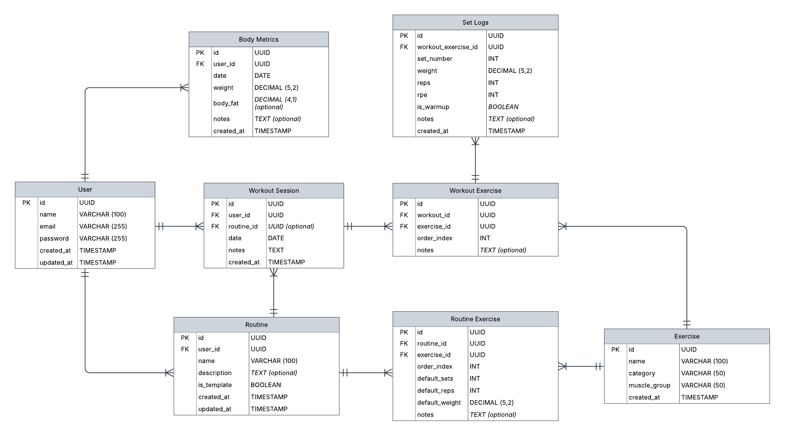

## ERD Diagram

---

## Tables

### Users

Stores user account information.

| Field | Type | Description |
|-------|------|-------------|
| id | UUID | Primary key |
| name | VARCHAR(100) | User's display name |
| email | VARCHAR(255) | Unique, for login |
| password_hash | VARCHAR(255) | Hashed password |
| created_at | TIMESTAMP | Account creation date |
| updated_at | TIMESTAMP | Last update |

---

### Body Metrics

Tracks user's body weight and measurements over time.

| Field | Type | Description |
|-------|------|-------------|
| id | UUID | Primary key |
| user_id | UUID | Foreign key → Users |
| date | DATE | Measurement date |
| weight | DECIMAL(5,2) | Weight in kg |
| body_fat | DECIMAL(4,1) | Optional body fat % |
| notes | TEXT | Optional notes |
| created_at | TIMESTAMP | Record creation date |

---

### Workout Sessions

Represents a complete workout (e.g., "Push Day - Jan 15").

| Field | Type | Description |
|-------|------|-------------|
| id | UUID | Primary key |
| user_id | UUID | Foreign key → Users |
| routine_id | UUID | Foreign key → Routines (optional) |
| date | DATE | Workout date |
| duration_minutes | INTEGER | Total workout time |
| notes | TEXT | Overall workout notes |
| created_at | TIMESTAMP | Record creation date |

---

### Exercises

Master list of all available exercises.

| Field | Type | Description |
|-------|------|-------------|
| id | UUID | Primary key |
| name | VARCHAR(100) | Exercise name |
| category | VARCHAR(50) | Push, Pull, Legs, Core, Cardio |
| muscle_group | VARCHAR(50) | Chest, Back, Legs, etc. |
| equipment | VARCHAR(50) | Barbell, Dumbbell, Bodyweight |
| instructions | TEXT | How to perform correctly |
| created_at | TIMESTAMP | Record creation date |

---

### Routines

Saved workout routines (e.g., "Push Day", "Pull Day").

| Field | Type | Description |
|-------|------|-------------|
| id | UUID | Primary key |
| user_id | UUID | Foreign key → Users |
| name | VARCHAR(100) | Routine name |
| description | TEXT | Optional description |
| is_template | BOOLEAN | True = reusable template |
| created_at | TIMESTAMP | Record creation date |
| updated_at | TIMESTAMP | Last update |

---

### Routine Exercises

Junction table linking routines to exercises.

| Field | Type | Description |
|-------|------|-------------|
| id | UUID | Primary key |
| routine_id | UUID | Foreign key → Routines |
| exercise_id | UUID | Foreign key → Exercises |
| order_index | INTEGER | Exercise order in routine |
| default_sets | INTEGER | Default number of sets |
| default_reps | INTEGER | Default reps per set |
| default_weight | DECIMAL(5,2) | Default weight |
| notes | TEXT | Specific notes for this exercise in this routine |

---

### Workout Exercises

Tracks exercises performed in a specific workout session.

| Field | Type | Description |
|-------|------|-------------|
| id | UUID | Primary key |
| workout_id | UUID | Foreign key → Workout Sessions |
| exercise_id | UUID | Foreign key → Exercises |
| order_index | INTEGER | Exercise order |
| notes | TEXT | Specific notes for this session |

---

### Set Logs

Individual sets logged for an exercise in a workout.

| Field | Type | Description |
|-------|------|-------------|
| id | UUID | Primary key |
| workout_exercise_id | UUID | Foreign key → Workout Exercises |
| set_number | INTEGER | Set number (1, 2, 3...) |
| weight | DECIMAL(5,2) | Weight lifted in kg |
| reps | INTEGER | Repetitions completed |
| rpe | INTEGER | Rate of Perceived Exertion (1-10) |
| is_warmup | BOOLEAN | True if warm-up set |
| notes | TEXT | Set-specific notes |
| created_at | TIMESTAMP | Record creation date |

